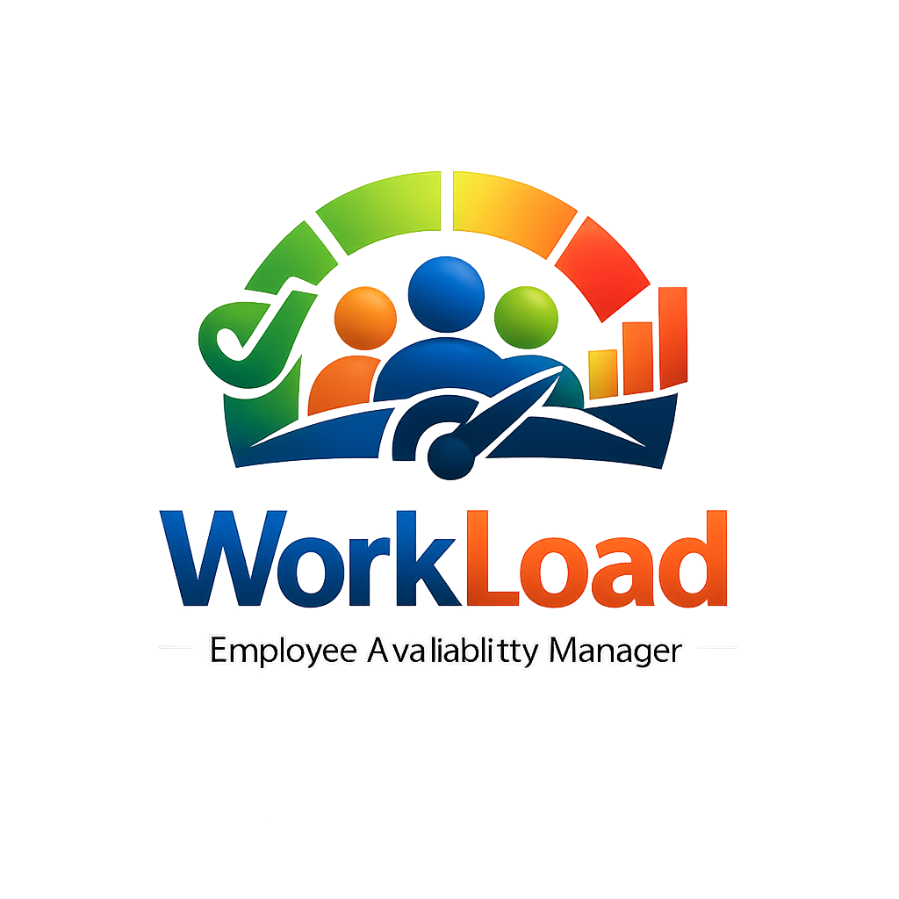
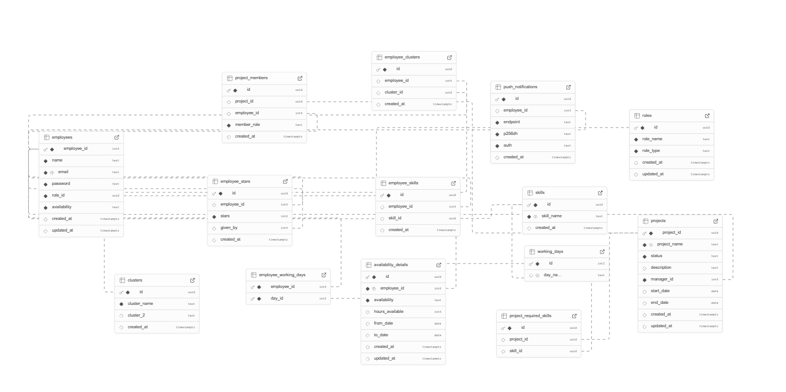

# WorkLoad - Backend

The WorkLoad Backend serves as the robust foundation for the Employee Availability Management system. Built with Node.js and Express, it handles secure authentication, complex data management via a **Normalized Database using Supabase**, and orchestrates real-time notifications, ensuring seamless data flow for the frontend application.

## 🗄️ Database & Technology
- **Database**: [Supabase (PostgreSQL)](https://supabase.com/)
- **Supabase Dashboard**: [Access Project Dashboard](https://supabase.com/dashboard/project/kpipsgtyriqbvzlyvfec/database/schemas)


- **Schema**: Fully normalized relational schema comprising tables for:
  - `employees`: Core user data and credentials.
  - `roles`: RBAC definitions (`role_name`, `role_type`).
  - `clusters`: Organisational clusters.
  - `skills`: Skill master list.
  - `projects`: Project details and status.
  - `availability_details`: Detailed tracking of employee availability (hours, dates).
  - `working_days`: Reference table for days of the week.
  - **Junction Tables**: `employee_skills`, `employee_clusters`, `employee_working_days`, `project_members`.
  - **Gamification**: `employee_stars` (tracking performance ratings).
  - **Notifications**: `push_notifications` (storing VAPID subscriptions).

## 🚀 Tech Stack

- **Runtime:** [Node.js](https://nodejs.org/)
- **Framework:** [Express.js](https://expressjs.com/)
- **Database Drivers:**
  - `@supabase/supabase-js` for Supabase interaction.
  - `mysql2` (Legacy support / specific modules).
- **Utilities:**
  - `dotenv` for secure environment variable management
  - `cors` for Cross-Origin Resource Sharing
  - `axios` for external API requests
  - `web-push` for VAPID Push Notification integration
  - `node-cron` for scheduled tasks (e.g., 15-day compliance check)
- **Deployment:** [Vercel](https://vercel.com/)

## ✨ Supported Business Logic

- **Compliance Enforcement:** Middleware checks the `updated_at` timestamp. A scheduled cron job runs daily to identify employees who haven't updated their details in 15 days, sending them a push notification reminder.
- **Role-Based Access Control (RBAC):**
  - **Managers:** Full access to view all employee availability data, create global "Inline Activities", and modify performance "Star" ratings.
    - **Username:** `manager@workload.com`
    - **Password:** `manager`
  - **Employees:** Read-only access to Manager-created activities; write access is strictly limited to their own personal availability and status.
    - **Username:** `employee@workload.com`
    - **Password:** `employee`
- **Gamification Logic:** Dedicated endpoints manage the calculation ("Stars") and leaderboard metrics.

## 📂 Project Structure

```text
workload_backend/
├── controllers/      # Logic for API requests (Auth, Employee, Notification)
├── db/               # Database connection configurations
├── routes/           # API route definitions
├── scripts/          # Cron jobs and helper scripts (scheduler.js, keys.txt, generate_keys.js)
├── index.js          # Entry point of the application
├── .env              # Environment variables (not committed)
└── package.json      # Dependencies and scripts
```

## 🛠️ Setup & Installation

1. **Clone the repository** (if you haven't already).
2. **Navigate to the backend directory:**

   ```bash
   cd workload_backend
   ```

3. **Install dependencies:**

   ```bash
   npm install
   ```

4. **Configure Environment Variables:**
   Create a `.env` file in the root directory:

   ```env
   PORT=5000
   SUPABASE_URL=https://kpipsgtyriqbvzlyvfec.supabase.co
   SUPABASE_KEY=your_supabase_anon_key
   VAPID_PUBLIC_KEY=your_vapid_public_key
   VAPID_PRIVATE_KEY=your_vapid_private_key
   VAPID_MAILTO=mailto:admin@workload-pwa.com
   ```

5. **Start the server:**

   ```bash
   npm start
   ```

   The server will typically run on `http://localhost:5000`.

## 📜 Scripts

- `npm start`: Runs the application using `node index.js`.
